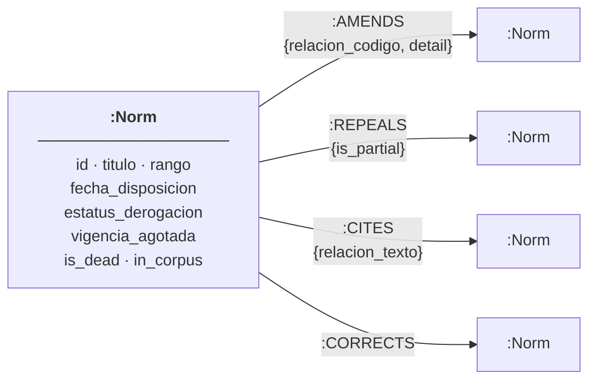

# Design Document

**BOE Legislative Graph — schema, tradeoffs, and what comes next.**
One page. Every decision has a reason.

---

## Schema

One node label. Four edge types. All edges point from the acting norm to the norm it acts on.

**Why one label:** every norm in the 12 288-norm corpus carries the same property set. Splitting by `rango` (Ley, Real Decreto, Orden…) would add join complexity without enabling a single query that a property filter can't handle more simply.

**Why edges point forward (acting → acted-on):** the BOE `analisis` block encodes each relationship twice — once in the source norm's `anteriores` and again in the target's `posteriores`. Processing only `anteriores` produces exactly one edge per relationship with no deduplication logic required. The reverse view is free via `MATCH (n)<-[r]-()`.

**Dropped edge types:** codes 470 (Constitutional Court declarations), 530 (pending constitutional questions), and 402 (interpretive instructions) connect norms to `BOE-T-` judicial documents that belong to a different domain. Including them would inflate degree counts and distort every briefing metric.

---

## The three biggest tradeoffs

**1. `is_dead` as a derived boolean, not a query over three fields.**
The status of a norm is encoded across three raw properties: `estatus_derogacion`, `vigencia_agotada`, and `estatus_anulacion`. Every briefing query that filters by status would need `WHERE n.estatus_derogacion = 'S' OR n.vigencia_agotada = 'S' OR n.estatus_anulacion = 'S'`. Storing a derived `is_dead` boolean at load time makes every briefing Cypher simpler and faster, and the computation happens once rather than on every query. The tradeoff: we lose the ability to distinguish between "explicitly repealed" and "validity expired" without joining back to the raw fields. For the four briefings, any form of dead-norm is correctly treated as dead. We keep the raw fields on the node so the distinction is still auditable.

**2. Pre-computed briefings over live queries.**
`briefings.py` runs four Cypher queries once and writes the results to JSON. The API serves them from memory. The alternative — recomputing on each page load — would add 50–500 ms of Neo4j latency to every request and require the API to hold a session open during rendering. The briefings answer strategic policy questions, not real-time monitoring; the corpus updates at most daily. Staleness is acceptable. A minister opening the dashboard gets sub-millisecond responses and never waits for a graph traversal.

**3. Law-level graph, not article-level.**
The BOE `analisis` block records relationships at the norm level: "Ley X modifies Ley Y." The `texto` block has the article-level detail, but parsing it would require NLP to identify article boundaries and match amendment language against article identifiers. Building an article-level graph would have taken the full week on its own. The law-level graph answers all four briefings exactly as specified. The `detail` property on each edge preserves the raw article reference text so the article-level layer can be added later without re-ingesting.

---

## What we cut

**Full-text search over legal text.** The `/texto` endpoint returns the actual statute in HTML. We ingest only `metadatos` and `analisis`. Adding text search would require a Neo4j full-text index or a separate Elasticsearch deployment, and the briefings don't need it.

**Incremental ingest.** `ingest.py` is resumable (skips files on disk) but not delta-aware (doesn't detect norms updated since last run). The `_index.json` carries `fecha_actualizacion` per norm; a production scheduler could filter to `from=<last_run_date>` and re-fetch only changed norms in minutes.

**Authentication.** The API has open CORS and no auth. Fine for a one-week demo. Any real ministry deployment adds an OAuth2 layer at the reverse proxy before touching the application code.

---

## With another week

**Article-level resolution.** Model `(:Artículo)` nodes inside each `(:Norm)` and make "SE MODIFICA el art. 42" an edge to a specific article. Briefing 01 becomes surgically precise: not "the Código Civil has been amended 85 times" but "Article 9 has been amended 11 times by 8 different laws."

**Amendment-path tracing.** A query like "show me everything that has ever touched this article, in chronological order" is a first-class use case for a legislative graph. The data is all there; it needs a UI that renders a timeline, not a force graph.

**AI-generated plain summaries.** Each briefing result is a norm with a title and a set of edges. A single prompt to a language model produces the plain-language explanation a minister would otherwise need a lawyer for. The graph is the retrieval layer; the model is the translation layer.

**Production deployment.** Containerise the stack (Neo4j, FastAPI, Next.js), add a nightly cron to refresh the index, and put it behind a ministry SSO. One Dockerfile per service, one Compose file, one pipeline.
