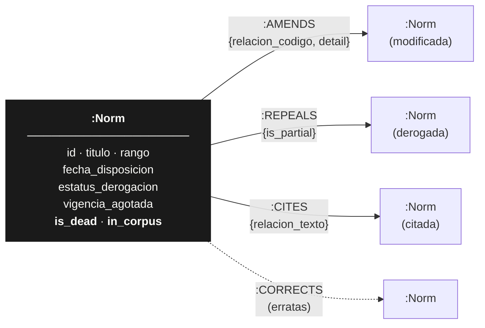

# Documento de diseño

**Grafo legislativo del BOE — esquema y por qué.**
Una página. Cada decisión tiene una razón.

---

## El esquema

Una sola etiqueta de nodo. Tres relaciones legislativas — más una de erratas. Todas las aristas
apuntan de la norma que actúa hacia la norma sobre la que actúa.

**`is_dead`** (derivado): la norma ya no rige — por derogación, vigencia agotada o anulación.
**`in_corpus`**: la norma pertenece al corpus consolidado que ingerimos; `false` marca un nodo
*stub* — citado desde fuera del corpus, del que solo conocemos el identificador. Con solo este
diagrama ya se entiende el 70 % del modelo: un grafo dirigido donde el sentido de la flecha es
la acción legislativa, y dos banderas bastan para responder "¿está viva?" y "¿la conocemos de
verdad?".

---

## La decisión central: por qué grafo, y por qué Neo4j

Un grafo es la respuesta obvia — Reversa ya lo sabe, lo pide en el propio reto. Lo que merece
defensa es **Neo4j frente a la alternativa real**: Postgres con CTEs recursivas, que también
modela grafos y ya teníamos en la caja de herramientas.

Postgres era viable. Pero las cuatro preguntas — "¿cuántas veces la han modificado, y cuántas
normas distintas?", "¿qué fracción del corpus vivo cita una ley derogada?", "¿cuál es el radio
de impacto de derogar la Ley 30/1992?" — cruzan varios saltos de relación con condiciones
distintas en cada uno. En Cypher son un `MATCH` de una línea con una flecha que cambia de
sentido. En SQL recursivo son una `WITH RECURSIVE` que hay que releer tres veces para confiar en
que no duplica caminos. El almacenamiento nativo de grafo hace que cada salto cueste lo mismo,
no una unión más sobre una tabla que crece. Y Neo4j Community en Docker no añade coste
operativo: una imagen, sin licencia, sin cuenta. La consulta natural en una línea, y cero
fricción para levantarlo — esa combinación inclina la balanza.

---

## Cuatro decisiones de modelado que merecen defensa

**1. Una sola relación por sentido — `AMENDS`, no también `AMENDED_BY`.**
Cada relación se almacena una vez, en el sentido de la acción (`A -[:AMENDS]-> B` = "A modifica
a B"). El sentido contrario se deriva con `MATCH (n)<-[:AMENDS]-()`, que Neo4j recorre igual de
rápido al revés. Duplicar la relación duplicaría escritura, espacio y — el día que una copia se
desincronice — bugs. Una arista, una verdad.

**2. Nodos *stub* para normas citadas fuera del corpus.**
Una norma del corpus puede citar una ley de 1932 ausente de `legislacion-consolidada` — el
corpus consolidado no es el universo legislativo completo, solo su parte viva y mantenida.
Frente a descartar la arista (perder la señal), creamos un `:Norm` con `in_corpus: false`,
`is_dead: null`: conserva la relación, real en derecho, sin fingir metadatos que no tenemos. El
filtro `in_corpus = true` los aparta de toda métrica de las cuatro preguntas — están solo para
que ninguna arista quede colgando.

**3. `estatus_derogacion` y dos campos más, colapsados en un booleano `is_dead`.**
El estado de vigencia vive repartido en tres campos crudos — `estatus_derogacion`,
`vigencia_agotada`, `estatus_anulacion` — cada uno con matices (derogación total o parcial,
vigente con modificaciones, vigencia agotada por desuso). Conservamos los tres, intactos y
auditables, pero derivamos `is_dead = (cualquiera de los tres = "S")`. Las cuatro preguntas solo
necesitan vivo/muerto; ninguna pregunta *por qué* dejó de estar vigente. El matiz se documenta;
no se modela — modelarlo habría significado repetir una disyunción de tres condiciones en cada
consulta, sin que ninguna briefing la usara jamás.

**4. Tres códigos de relación descartados — 470, 530, 402.**
El bloque `analisis` codifica cada relación con un número (`relacion.codigo`); trece códigos se
mapean a `AMENDS`/`REPEALS`/`CITES`/`CORRECTS`. Tres se excluyen a propósito:

| Código | Texto | Por qué se descarta |
|---|---|---|
| 470 | SE DECLARA / Cuestión resuelta | Enlaza con sentencias del Constitucional (`BOE-T-…`) — dominio judicial, no legislativo; generaría nodos de grado artificialmente alto |
| 530 | Cuestión (pendiente) | Una cuestión de inconstitucionalidad sin resolver no es una relación legislativa promulgada |
| 402 | SE INTERPRETA | Orientación interpretativa, no una modificación vinculante — inflaría `AMENDS` sin aportar señal |

El criterio: el grafo solo contiene **actos legislativos promulgados** — modificar, derogar,
citar, corregir. Así "grado de entrada" y "de salida" significan exactamente lo que el Consejo
necesita.

---

## Lo que decidimos no construir

**Artículos individuales.** El `analisis` registra relaciones a nivel de norma ("la Ley X
modifica la Ley Y"); bajar al artículo exigiría NLP para casar lenguaje de enmienda con límites
de artículo en el texto íntegro — la semana entera, para una precisión que ninguna de las
cuatro preguntas pide.

**El texto íntegro de cada norma.** `/texto` devuelve el articulado en HTML. No lo ingerimos:
el grafo responde sin él, y persistirlo multiplicaría el almacenamiento por un texto que
ninguna consulta lee.

**Versionado temporal de las relaciones.** No registramos *cuándo* nació cada `AMENDS` o
`CITES`, solo su existencia actual. Una cronología de "todo lo que ha tocado este artículo"
es un caso de uso legítimo a futuro — pero las cuatro briefings preguntan por el estado *actual*
del ordenamiento, que el grafo ya captura sin ambigüedad.

---

*Esquema completo, tabla íntegra de códigos de relación y detalle de cada decisión, en `SCHEMA.md`.*
