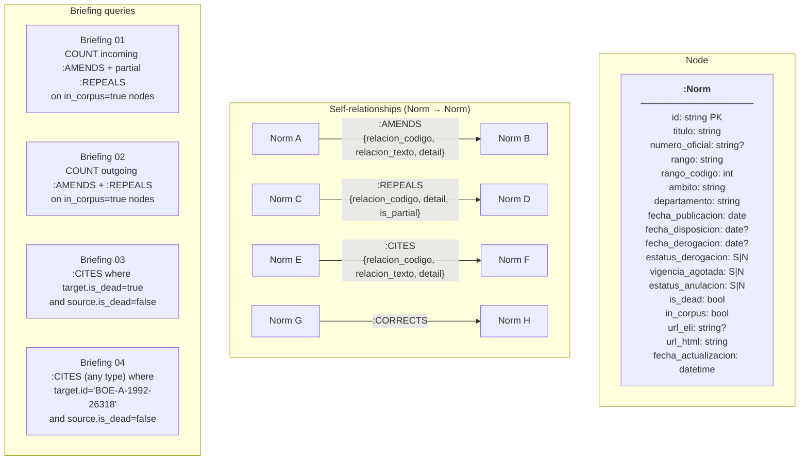

# Graph Schema

Derived from reading 10 sample norms across the corpus (1887–2026, estatal + autonómico,
in-force + repealed + expired). Every decision below is followed by a one-sentence justification.

---

## 1. Node Labels and Properties

### `:Norm`

Every ingested catalogue entry becomes a single `:Norm` node; the loaded
corpus (`in_corpus: true`) holds 12 045 norms.
Norms referenced in `id_norma` fields but absent from the corpus also become `:Norm` nodes,
flagged with `in_corpus: false` (see §5).

| Property | Type | Source | Notes |
|---|---|---|---|
| `id` | string PK | `metadatos.identificador` | e.g. `BOE-A-1992-26318` |
| `titulo` | string | `metadatos.titulo` | |
| `numero_oficial` | string \| null | `metadatos.numero_oficial` | e.g. `30/1992` — absent on some norms |
| `rango` | string | `metadatos.rango.texto` | `Ley`, `Real Decreto`, `Orden`, … |
| `rango_codigo` | int | `metadatos.rango.codigo` | for range-group filtering |
| `ambito` | string | `metadatos.ambito.texto` | `Estatal` or `Autonómico` |
| `departamento` | string | `metadatos.departamento.texto` | issuing ministry or autonomous community |
| `fecha_disposicion` | date \| null | `metadatos.fecha_disposicion` | YYYYMMDD; absent on some very old norms |
| `fecha_publicacion` | date | `metadatos.fecha_publicacion` | always present |
| `fecha_vigencia` | date \| null | `metadatos.fecha_vigencia` | |
| `fecha_derogacion` | date \| null | `metadatos.fecha_derogacion` | |
| `estatus_derogacion` | string | `metadatos.estatus_derogacion` | raw S/N — stored as-is for auditability |
| `vigencia_agotada` | string | `metadatos.vigencia_agotada` | raw S/N |
| `estatus_anulacion` | string | `metadatos.estatus_anulacion` | raw S/N |
| `is_dead` | bool | derived | see §4 |
| `url_eli` | string \| null | `metadatos.url_eli` | absent on pre-ELI norms (e.g. 1887 norm) |
| `url_html` | string | `metadatos.url_html_consolidada` | always present |
| `in_corpus` | bool | — | `true` for the 12 045 loaded norms; `false` for stub nodes |
| `fecha_actualizacion` | datetime | `metadatos.fecha_actualizacion` | for incremental refresh |

**Justification for a single label:** all norms in the corpus share the same property set;
splitting by `rango` (Ley, Real Decreto…) would multiply labels without enabling any query
that couldn't be answered with a property filter.

---

## 2. Relationship Types and Direction

All edges are derived from **`analisis.referencias.anteriores`** of the source norm.
An `anterior` entry with `id_norma = B` in norm A means A acts on B, so the edge points **A → B**.
The `posteriores` of each norm are the mirror view of the same edges and are **not stored separately**
to avoid duplicates; they are queryable by reversing direction.

### `:AMENDS` — A modifies/adds to/substitutes B

```
(A:Norm)-[:AMENDS {relacion_codigo, relacion_texto, detail}]->(B:Norm)
```

| Property | Type |
|---|---|
| `relacion_codigo` | int |
| `relacion_texto` | string |
| `detail` | string (the `texto` field) |

**Relation codes captured:** 270 (MODIFICA), 407 (AÑADE), 245 (SUSTITUYE), 230 (DEJA SIN EFECTO),
231 (SUSPENDE), 235 (SUPRIME), 401 (PRORROGA), 406 (AMPLÍA).
All represent a surviving legal dependency — B is changed in some dimension but not abolished.

| Code | Text | Why AMENDS |
|---|---|---|
| 270 | MODIFICA | Changes the text of specific provisions |
| 407 | AÑADE | Adds new articles or sections |
| 245 | SUSTITUYE | Replaces specific provisions with new text |
| 230 | DEJA SIN EFECTO | Suspends/nullifies without formal repeal |
| 231 | SUSPENDE | Temporarily suspends application of provisions; reversible, text unchanged |
| 235 | SUPRIME | Removes specific articles — structural modification, mirror of AÑADE |
| 401 | PRORROGA | Extends the operative period (temporal scope) of target norm |
| 406 | AMPLÍA | Extends the application scope (breadth) of target norm |

**Used by:** Briefing 01 (count incoming AMENDS per norm), Briefing 02 (count outgoing AMENDS per norm).

### `:REPEALS` — A derogates B (wholly or partially)

```
(A:Norm)-[:REPEALS {relacion_codigo, detail, is_partial}]->(B:Norm)
```

| Property | Type | Notes |
|---|---|---|
| `relacion_codigo` | int | always 210 |
| `detail` | string | |
| `is_partial` | bool | `true` when `detail` names specific articles |

**Relation codes captured:** 210 (DEROGA).
`is_partial` is set by checking whether the `texto` field references specific articles
(`"los arts."`, `"el art."`, `"la disposición"`); complete derogation has `texto` like
`"en la forma indicada, la Ley 30/1992"` or is empty.

**Used by:** Briefing 01 (partial REPEALS count as amendments to the target), Briefing 02
(all outgoing REPEALS count toward omnibus score).

### `:CITES` — A invokes B as authority or reference

```
(A:Norm)-[:CITES {relacion_codigo, relacion_texto, detail}]->(B:Norm)
```

**Relation codes captured:** 330 (CITA), 440 (DE CONFORMIDAD con / SE DICTA DE CONFORMIDAD),
490 (SE DESARROLLA), 331 (SE DICTA EN RELACIÓN), 426 (TRANSPONE), 480 (DECLARA la vigencia).
All six express a legal dependency on B remaining valid; if B is repealed, A is operating
on dead ground — exactly what Briefings 03 and 04 query.

| Code | Text | Why CITES |
|---|---|---|
| 330 | CITA | Explicit textual citation of another norm |
| 440 | DE CONFORMIDAD / SE DICTA DE CONFORMIDAD | Issued pursuant to — invokes target as legal authority |
| 490 | SE DESARROLLA | Implementing regulation — depends on target for its legal basis |
| 331 | SE DICTA EN RELACIÓN | Issued in connection with — derivative citation |
| 426 | TRANSPONE | Transposes an EU Directive into national law; same dependency structure as SE DESARROLLA. Targets are often DOUE-L-… documents not in our corpus — they become stub nodes with `in_corpus: false` |
| 480 | DECLARA la vigencia | Explicitly declares another norm remains in force; creates a citation dependency and is particularly relevant to Briefing 03 (the declared norm must stay valid for the citing norm to function) |

**Used by:** Briefing 03 (CITES where B.is_dead), Briefing 04 (CITES where B.id = `BOE-A-1992-26318`).

### `:CORRECTS` — A is an erratum for B

```
(A:Norm)-[:CORRECTS]->(B:Norm)
```

**Relation codes captured:** 201 (CORRECCIÓN de errores).
Stored separately rather than merged into AMENDS because errata inflate amendment counts
(Briefing 01 would otherwise overcount); marking them as corrections preserves completeness
without polluting graph metrics.

---

## 3. Relation Code Reference (complete)

### Mapped codes

| Code | Text | Edge type |
|---|---|---|
| 201 | CORRECCIÓN de errores | CORRECTS |
| 210 | DEROGA / SE DEROGA | REPEALS |
| 230 | DEJA SIN EFECTO | AMENDS |
| 231 | SUSPENDE / SE SUSPENDE | AMENDS |
| 235 | SUPRIME | AMENDS |
| 245 | SUSTITUYE | AMENDS |
| 270 | MODIFICA / SE MODIFICA | AMENDS |
| 331 | SE DICTA EN RELACIÓN | CITES |
| 330 | CITA | CITES |
| 401 | PRORROGA / SE PRORROGA | AMENDS |
| 406 | AMPLÍA / SE AMPLÍA | AMENDS |
| 407 | AÑADE / SE AÑADE | AMENDS |
| 426 | TRANSPONE | CITES |
| 440 | DE CONFORMIDAD / SE DICTA DE CONFORMIDAD | CITES |
| 480 | DECLARA la vigencia | CITES |
| 490 | SE DESARROLLA | CITES |

### Dropped codes (and why)

| Code | Text | Decision | Justification |
|---|---|---|---|
| 470 | SE DECLARA / Cuestión resuelta | **DROP** | Links to `BOE-T-` Constitutional Court rulings — judicial domain, not legislative; creates spurious high-degree nodes unrelated to the four briefings |
| 530 | Cuestión (pending) | **DROP** | Unresolved constitutional challenge — not an enacted relationship; conflates legislative action with judicial process |
| 402 | SE INTERPRETA | **DROP** | Administrative interpretive guidance — not a binding amendment; appears rarely and would inflate AMENDS degree counts |

**Net effect of drops:** the graph contains only relationships that represent enacted legislative
action (amendment, repeal, citation), making degree-based metrics directly meaningful for
the four briefings.

---

## 4. How `estatus_derogacion` Maps to `is_dead`

Three distinct in-force states appear in the corpus:

| `estatus_derogacion` | `vigencia_agotada` | `estatus_anulacion` | Observed example | Interpretation |
|---|---|---|---|---|
| `N` | `N` | `N` | BOE-A-1889-4763 (Código Civil) | **In force** — active, possibly partially amended |
| `S` | `S` | `N` | BOE-A-1992-26318 (Ley 30/1992) | **Repealed** — explicitly derogated by another norm |
| `N` | `S` | `N` | BOE-A-2021-1379 (Resolución AEAT 2021) | **Expired** — validity exhausted without explicit repeal (e.g. annual administrative plans) |
| `N` | `N` | `S` | (rare, possible) | **Annulled** — struck down by Constitutional Court |

**Derived property:**
```
is_dead = (vigencia_agotada == "S") OR (estatus_derogacion == "S") OR (estatus_anulacion == "S")
```

**Partial repeal nuance:** a norm with `estatus_derogacion: "N"` and `vigencia_agotada: "N"` may
still have incoming REPEALS edges that specify individual articles (e.g. `"SE DEROGA los arts. 299 bis,
301 a 324"`). In this case `is_dead = false` — the norm as a whole is alive — but individual
provisions are dead. The `is_partial` property on `:REPEALS` edges exposes this.
For the briefings, partial REPEALS to a living norm count toward Briefing 01's amendment score;
they do **not** make the norm dead for Briefings 03/04 purposes.

**Why store the raw fields too:** `is_dead` is a fast boolean for graph queries, but
`estatus_derogacion` and `vigencia_agotada` are retained as raw strings so auditors can
verify the derivation and catch any future API values we haven't seen.

---

## 5. Citations to Norms Not in the Corpus

Two classes of out-of-corpus references appear:

### 5a. `id_norma` is empty

Observed in: BOE-A-1887-4896 (cites pre-1887 Real Órdenes), BOE-A-2011-17718
(cites DOGA decrees never published in the BOE).

**Decision:** Create a stub `:Norm` node with:
- `id` = a deterministic slug derived from the `texto` field (e.g. `EXTERNAL::Decreto_263_2007_DOGA`)
- `in_corpus: false`
- `is_dead: null` (status unknown)
- All other properties null

**Justification:** dropping the edge entirely would lose the fact that a live norm legally
depends on an external instrument; the stub preserves the edge while `in_corpus: false` lets
all briefing queries exclude stubs from counts (since their status is unknowable).

### 5b. `BOE-T-` prefix IDs

Observed in posteriores of BOE-A-1889-4763 (Constitutional Court sentencias).
These are dropped (see §3) because the corresponding edge type (470 SE DECLARA) is excluded,
so no stub is needed.

### 5c. Normal BOE ID not in our loaded corpus

Some `anteriores` reference norms (e.g. old pre-corpus laws from the Gaceta era) that exist
in the BOE system but may not be in the consolidated-legislation collection.

**Decision:** Create a stub `:Norm` node with `in_corpus: false`, `is_dead: null`.
Same rationale as 5a — the edge is legally real even if the target's metadata is unavailable.

---

## 6. Mermaid Schema Diagram



---

## Summary: Schema in One Table

| Concept | Choice | Key reason |
|---|---|---|
| Node labels | Single `:Norm` | Property filter covers all differentiation needed |
| Edge source of truth | `anteriores` only | Avoids duplicate edges from mirrored `posteriores` |
| AMENDS | codes 270, 407, 245, 230 | All express surviving dependency after modification |
| REPEALS | code 210 | Derogation; `is_partial` flag distinguishes article-level from total |
| CITES | codes 330, 440, 490, 331 | All create legal dependency on target remaining valid |
| CORRECTS | code 201 | Kept separate to avoid inflating amendment degree counts |
| Dropped | codes 470, 530, 402 | Judicial / pending / interpretive — not enacted legislative acts |
| `is_dead` | `vigencia_agotada=S OR estatus_derogacion=S OR estatus_anulacion=S` | Captures all three termination paths |
| Partial repeal | `is_dead=false` + incoming REPEALS with `is_partial=true` | Norm still alive; individual provisions dead |
| External stubs | `:Norm` with `in_corpus=false`, `is_dead=null` | Preserves edges without distorting briefing counts |
